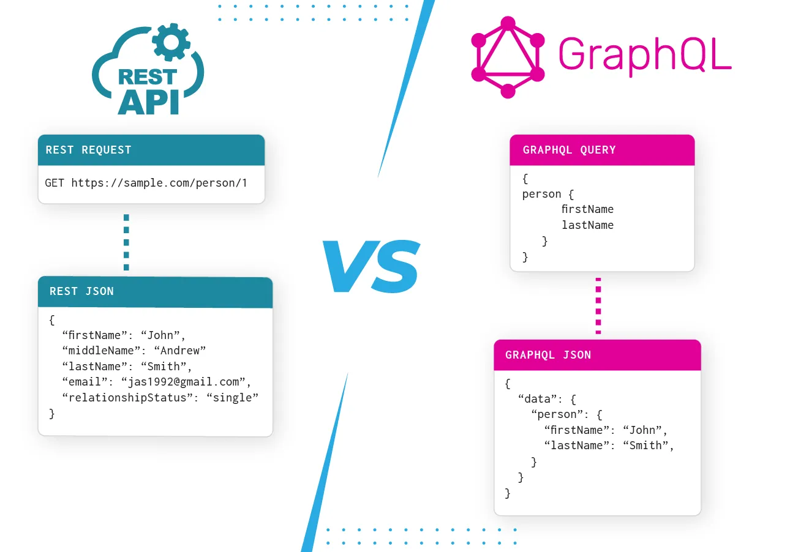
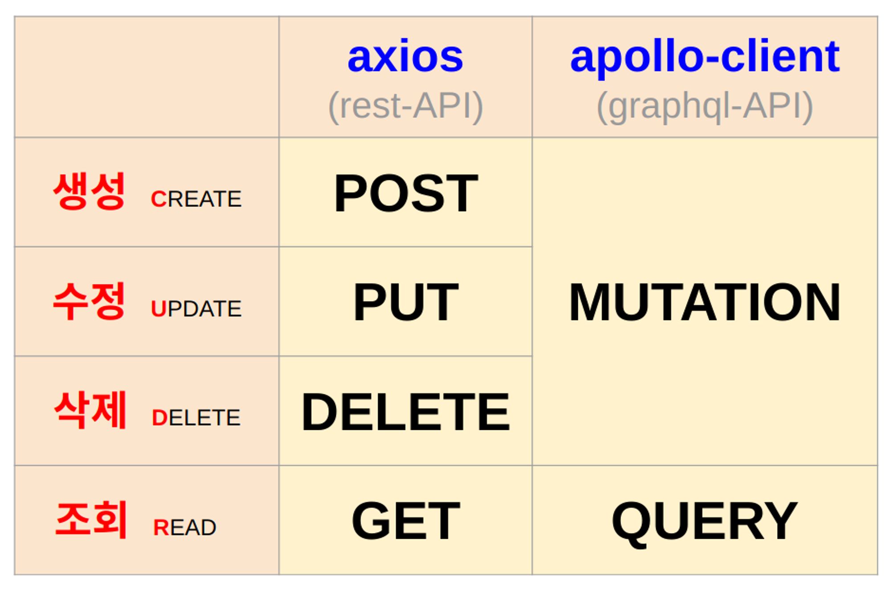
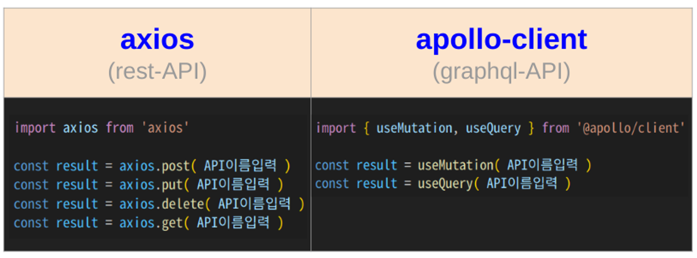

# Rest-API vs Graphql-API

## 공통점 

1. `HTTP 통신`
   * HTTP : 텍스트, html을 전송하는 도구 -> 객체를 주고받을 수 없어서 텍스트로 표기 (JSON)
   * JSON : 자바스크립트 객체 표기법

2. `구성` 
   * 헤더 : 요약 정보 (✉️편지봉투)
       * 보내는 이, 보내는 내용 형태
   * 바디 : 주고받은 객체가 들어있음

  

## 차이점 

|                    |               REST               |           GRAPHQL          |
|:------------------:|:--------------------------------:|:--------------------------:|
|     대규모 접속자 처리     |               어려움                |             쉬움             |
|         형태         | 주소 https://naver.com/board/1 |       함수 board(1)      |
|       응답 데이터       |              모든 데이터              | 필요한 데이터만 골라서 응답 -> **비용절감** |
| API에 전송을 요청하는 라이브러리 |              axios              | apollo-client |

  

## API

API에 `요청`할 때 보내는 데이터는 **API 함수에 들어갈 인자**   
`응답`으로 받게되는 데이터는 **API 함수의 return 데이터**

### CRUD

기본적인 데이터 처리 기능  
📌 Create(생성), Read(상세 조회), Update(수정), Delete(삭제) + 목록 조회  
하나의 기능을 만들 때 최소한 5개의 API가 있어야 함

* Graphql은 데이터 변경 유무에 따라 Queriy, Mutation을 구분

### 사용 방법 

### API 명세서

|         | REST |  GRAPHQL  |
|:-------:|:----:|:---------:|
| API 테스트 | 포스트맨 https://www.postman.com/ |  플레이그라운드 https://www.graphqlbin.com/v2/new  |
| API 명세서 | 스웨거 https://swagger.io/  |  플레이그라운드 https://www.graphqlbin.com/v2/new  |

* Graphql은 테스트와 명세서가 합쳐져 있어서 편리 

  

## Graphql-API

페이스북 개발 - 페이스북에서 발생하는 수많은 데이터를 처리하기 위함  
facebook, airbnb, github 등 유명한 사이트에서 사용 중

  

## 🤔 rest-API를 알아야 하는 이유

1. 많은 사람이 사용
2. 내가 일하는 회사에서 rest-API를 사용할 수 있음
3. `OPEN-API`에서 주로 rest-API를 제공

  

## 참고 사이트

> https://graphql.org/  
> https://www.howtographql.com/basics/1-graphql-is-the-better-rest/  
> https://github.com/graphql/graphql-playground

