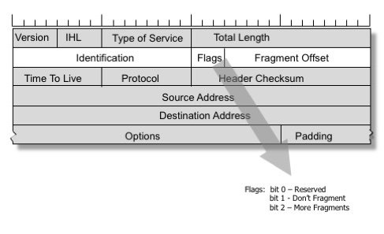

# TCP/IP 4계층

## MTU

MTU(Maximum Transmission Unit)란 네트워크에 연결된 장치가 받아들일 수 있는 **최대 데이터 패킷의 크기**, **가장 큰 PDU 크기**   
이 크기를 기준으로 데이터가 쪼개져서 패킷화(패킷이 쪼개질 때 MTU를 기반으로 쪼개짐)  

Ex. 🚛 터널 높이제한  


Router C의 MTU가 1400바이트이기 때문에 패킷이 분할되는 모습


* 통신을 하는 양쪽 끝은 두 장치의 MTU 뿐만 아니라, 중간의 모든 라우터, 스위치, 서버를 고려해야 함
* 네트워크 경로 상의 아무 장치나 MTU보다 패킷이 크면 그 패킷은 분할될 수도 있음

<br>

### 패킷이 분할되지 않는 경우

네트워크 경로 상에 있는 어떠한 라우터나 장치의 MTU를 초과할때,    
분할해서 전달하는 것이 아니라 아예 **전달하지 않을 수도 있음**

* IPv6 : 분할을 허용하지 않음
* IPv4 : 헤더에는 flags 필드가 있는데, bit가 1이 되면 "Don't Fragment" 플래그가 활성화된다는 의미. 이 때 분할은 불가능



<br><br>

## MSS
MSS(Maximum Segment Size)는 **데이터의 크기(payload의 크기)** 만을 가리킴

### MTU와 MSS

* MTU : IP 헤더와 TCP 헤더의 크기까지 합침 
* MSS : TCP에서 사용할 수 있는 데이터의 크기이자, IP 헤더와 TCP 헤더를 뺀 크기 


일반적으로 MTU는 1500 바이트, MSS는 1460 바이트  
네트워크를 통해 데이터를 보낼 때, MTU가 1500이라도 데이터는 보통 1460바이트 이하의 크기로 보내야 전달 가능  
(TCP를 쓰지 않는다는 등의 이유로 달라질 수도 있음)

* 이더넷 프레임 : 이더넷 헤더 14 바이트, FCS 4 바이트가 포함된 것
  * 일반적으로 1518 바이트 
* FCS(Frame Check Sequence) : 데이터의 에러 검출을 돕기 위한 필드
  * CRC에 의해 생성된 값이 포함

<br>

### MTU 확인하기

#### ping
```
ping www.google.com -f -l 1500
ping www.google.com -f -l 1472
```

#### netsh
```
netsh interface ipv4 show interfaces
```

<br><br>

## PMTUD

PMTUD(Path MTU Discovery)는 수신자와 송신자의 경로 상에서 장치가 패킷을 누락한 경우,   
테스트 패킷의 크기를 낮추면서 MTU에 맞게끔 반복해서 보내는 과정

💡 MTU를 초과해서 패킷이 분할되지 않는 경우, 패킷의 크기를 줄여서 다시 보내는 과정    
