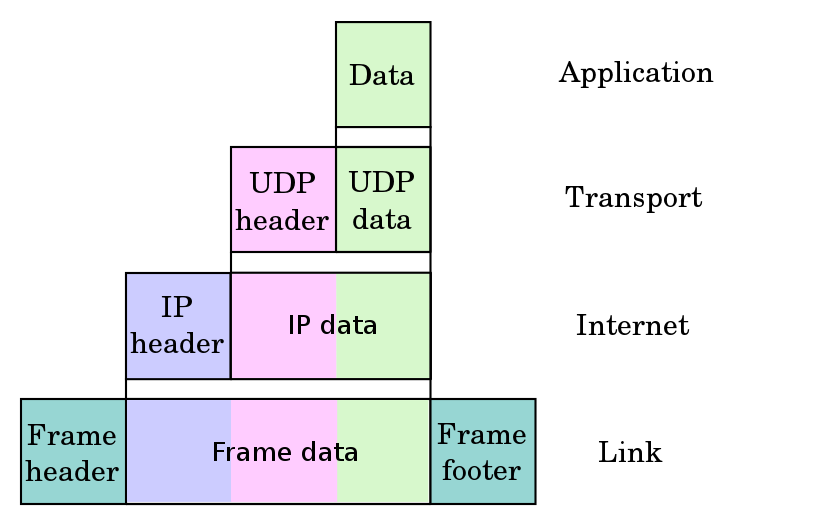
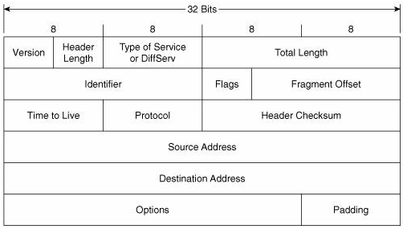
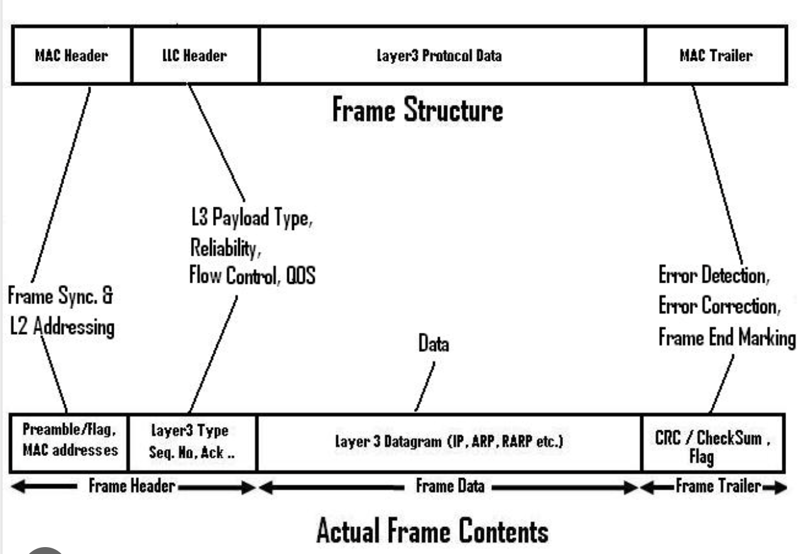
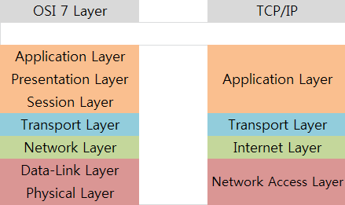

# TCP/IP 4계층

## TCP/IP 4계층

TCP/IP 4계층은 인터넷에서 컴퓨터들이 서로 **정보를 주고받는 데 쓰이는 프로토콜의 집합**  
TCP/IP는 Transmission Control Protocol, Internet Protocol의 줄임말   
인터넷을 통해 데이터를 보낼 때 TCP/IP를 이용해서 보냄   
💡 독립적  

 

### 애플리케이션 계층(응용 계층)

응용 프로그램이 사용되는 프로토콜 계층  

* HTTP, FTP, SSH, SMTP 
* 웹 서비스, 이메일 등 서비스를 실질적으로 사람들에게 제공하는 층

 

### 전송 계층(transport)

송신자와 수신자를 연결하는 통신 서비스를 제공    
애플리케이션과 인터넷 계층 사이의 데이터가 전달될 때의 중계 역할  
💡 오류 체크 

* TCP, UDP 
* 애플리케이션 계층에서 받은 메시지를 기반으로 세그먼트 또는 데이터그램으로 **데이터를 쪼개고** 데이터가 오류 없이 순서대로 전달되도록 도움을 주는 층   

- 연결지향 통신(TCP)
- 신뢰성(체크섬과 오류감지코드를 통해 패킷 손실을 방지하며 ACK 세그먼트 등으로
  수신을 확인, UDP는 체크섬만으로 기본 오류감지코드만 제공, TCP는 전부)
- 흐름제어(송신측과 수신측의 데이터처리 속도 차이를 해결하기 위한 기법)
- 혼잡제어(네트워크 내에 패킷의 수가 과도하게 증가하는 현상을 방지, 제거)

 

### 인터넷 계층(network)

장치로부터 받은 네트워크 패킷을 IP 주소로 지정된 목적지로 전송하기 위해 사용되는 계층  
💡 주소 역할 

* IP, ICMP, ARP 
* 한 노드에서 다른 노드로 전송 계층에서 받은 세그먼트 또는 데이터그램을 **패킷화**해서 목적지로 전송하는 역할

 

### 링크 계층 (네크워크 엑세스 계층)

데이터가 네트워크를 통해 물리적으로 전송되는 방식  

* 전선, 광섬유, 무선 등으로 실질적으로 데이터를 전달하며 장치 간에 신호를 주고받는 규칙을 정하는 계층

  

## 캡슐화, 비캡슐화

### 캡슐화

캡슐화(encapsulation)란, 송신자가 수신자에게 데이터를 보낼 때,  
데이터가 각 계층을 지나며 **각 계층의 특징이 담긴 헤더가 붙는 과정** 

* 전송 계층 - TCP 헤더 추가
* 네트워크 계층 - IP 주소 헤더 추가

 

### 비캡슐화

캡슐화(decapsulation)란, 캡슐화의 역과정   
수신자 측에서 캡슐화된 데이터를 역순으로 제거하면서 응용 계층까지 도달하는 것  

  

## PDU

PDU(Protocol data unit)란, TCP/IP 4계층을 기반으로 설명했을 때 **각 계층의 데이터 단위**

* 애플리케이션 계층 : 메시지  
* 전송 계층 : 세그먼트(TCP), 데이터그램(UDP)  
* 네크워크 계층 : 패킷   
* 링크 계층 : 프레임(데이터 링크 계층), 비트(물리 계층)   

 

`세그먼트` 적절한 크기로 쪼갠 조각(세그먼트 = 데이터그램 동일 의미)  
`패킷` 세그먼트에 SP와 DP가 포함된 IP 헤더가 붙은 형태의 조각  
`프레임` MAC 주소 헤더와 CRC/체크섬 트레일러가 붙은 조각  

### IP 헤더

* IPv4 기준
* SP: 송신자의 32비트 IP 주소 
* DP: 수신자의 32비트 IP 주소

 

### 프레임

#### CRC/체크섬 트레일러

데이터의 **오류 감지**를 위한 수학적 함수가 적용된 값  
링크의 오류(과도한 트래픽 등)로 인해 데이터 손상을 감지하는 역할  

* 모든 계층에 전달되는 데이터가 쪼개져서 패킷으로 전달된다는 것도 맞는 말이지만, PDU에 따라 부르는 것이 더 맞는 표현 

  

## OSI 7계층

TCP/IP 4계층 모델로 불리지만, **OSI 7계층 모델**로 설명하기도 함

### ⭐️ 차이점 

각각의 역할은 동일   
쪼개짐의 정도, 용어가 다름  

* TCP/IP 계층과 달리 OSI 계층은 애플리케이션 계층을 세 개로 쪼개고
* 링크 계층을 데이터 링크 계층, 물리 계층으로 나눠서 표현하는 것이 다르며, 
* 인터넷 계층을 네트워크 계층으로 부른다는 점이 다름
* 이 계층들은 특정 계층이 변경되었을 때 다른 계층이 영향을 받지 않도록 설계됨
