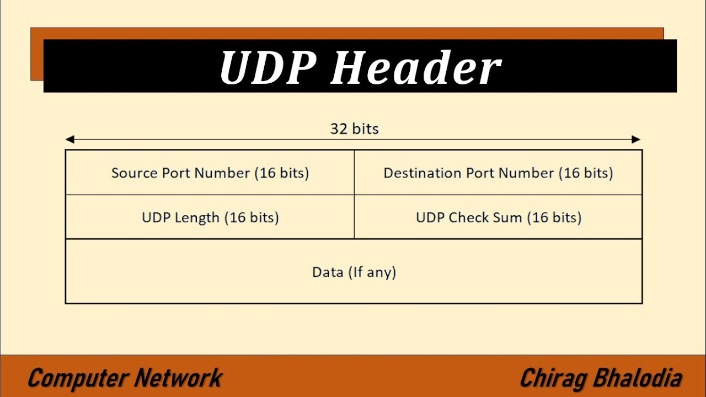

# TCP/IP 4계층 

## 전송 계층(transport) 

TCP, UDP가 대표적  
애플리케이션계층에서 받은 메시지를 기반으로 세그먼트(TCP) 또는 데이터그램(UDP)으로 데이터를 쪼개고, 
데이터가 오류없이 순서대로 전달되도록 도움을 주는 층

  

## TCP

### 1. 가상회선 패킷 교환 방식
   * 회선을 기반으로 순서대로

### 2. 오류검사 메커니즘
   1. 재전송 : 시간초과 기간이 지나면 서버는 전달되지 않은 데이터에 대해 재전송 시도
   2. 체크섬 : 체크섬을 통해 무결성(데이터가 올바르게 왔는지)을 평가. 송신된 데이터의 체크섬과 수신된 데이터의 체크섬 값을 비교해서 올바르게 왔는지를 확인
   
### 3. 헤더

20 ~ 60바이트로 가변적

  

## UDP

### 1. 데이터그램 패킷 교환 방식
   * 순서 보장 X

### 2. 오류검사는 단순한 체크섬만 지원
   * 재전송 X

### 3. 헤더

8바이트(32비트)로 고정길이

  

## ⭐️ TCP, UDP 차이점

|          |                           전송 제어 프로토콜(TCP)                           |                     데이터그램 프로토콜(UDP)                     |
|:--------:|:-------------------------------------------------------------------:|:-------------------------------------------------------:|
| 패킷 교환 방식 |                            가상회선 패킷 교환 방식                            |                     데이터그램 패킷 교환 방식                      |
|   신뢰성    |                                  O                                  |                            X                            |
|   오류검사   |                              재전송, 체크섬                               |                           체크섬                           |
| 패킷의 순서보장 |                                  O                                  |                            X                            |
|  헤더 길이   |                          (20-60)바이트 가변 길이                           |                       8바이트 고정 길이                        |
|   연결보장   |연결을 보장함   3웨이 - 핸드셰이크로 연결을 맺고  4 - 웨이 핸드셰이크로 연결을 해제하는 작업이 필요 |연결을 보장하지 않음  그냥 데이터를 보냄  연결을 유지하고 해제하는데 드는 비용이 없음|
| 브로드캐스트지원 |                                  X                                  |                            O                            |
|    속도    |                                 느림                                  |                           빠름                            |

