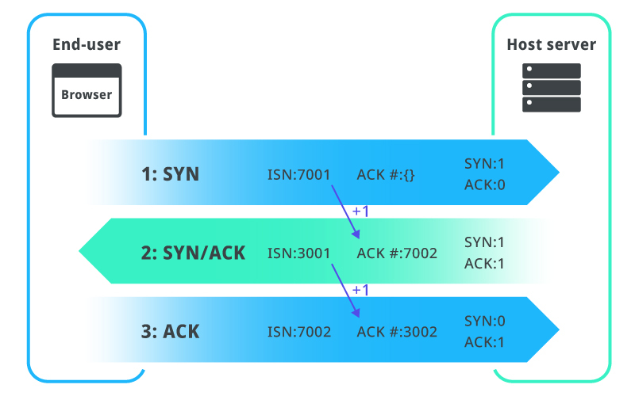
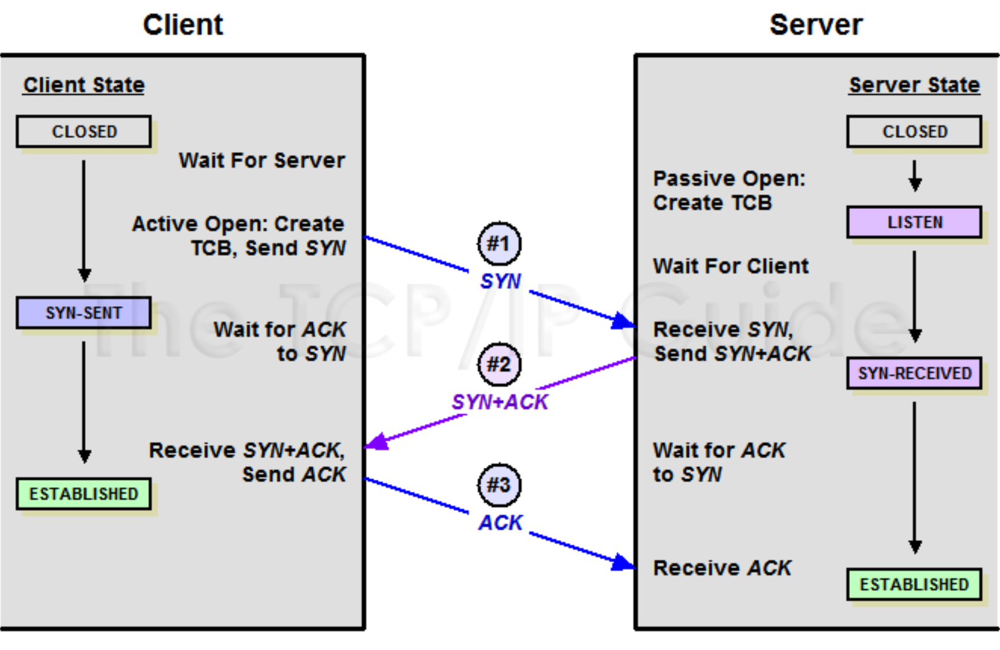

# 3-way Handshake

## TCP의 연결성립과정 : TCP 3 way handshake

클라이언트와 서버 간의 가상 연결

> 1️⃣ `클라이언트` SYN (접속 요청) -> 2️⃣ `서버` SYN + ACK (요청 수락) -> 3️⃣ `클라이언트` ACK (+ 4️⃣ 데이터 전송)



1. SYN 단계 : 클라이언트는 서버에 클라이언트의 ISN(고유번호)을 담아 SYN을 보냄
2. SYN + ACK 단계 : 서버는 클라이언트의 SYN을 수신하고 서버의 ISN을 보내며 승인번호로 클라이언트의 ISN + 1을 보냄
3. ACK 단계 : 클라이언트는 서버의 ISN + 1한 값인 승인번호를 담아 ACK를 서버에 보냄

<br>

* ISN : initial sequence number의 약자. TCP(Transmission Control Protocol) 기반 데이터 통신에서 각각의 새 연결에 할당된 고유한 32비트 시퀀스 번호
  * TCP 연결을 통해 전송되는 다른 데이터 바이트와 충돌하지 않는 시퀀스 번호를 할당하는 데 도움이 됨
  * 고유번호를 통해 통신이 서로 충돌하지 않도록 함 

* SYN : synchronization의 약자, 연결 요청 플래그 
* ACK : acknowledgement의 약자, 응답 플래그

<br><br>

## 클라이언트와 서버의 상태

### listen

서버는 listen 상태가 되어야 클라이언트의 연락을 받을 수 있음   
클라이언트의 연락을 기다리는 상태, 이를 기반으로 서버 메소드의 이름이 결정됨



```js
const express = require('express');
const app = express();
const port = 3000;

app.get('/', (req, res) => {
    res.send('Hello World!');
});

// listen 메소드를 기반으로 서버가 구동됨  
app.listen(port, () => {
    console.log(`Example app listening on port ${port}`);
});
```

💡 이러한 서버와 클라이언트 간의 연결 설정 과정이 있기 때문에 TCP는 **신뢰성**이 있음  
반면, UDP는 이런 과정이 없기 때문에 신뢰성이 없음  
