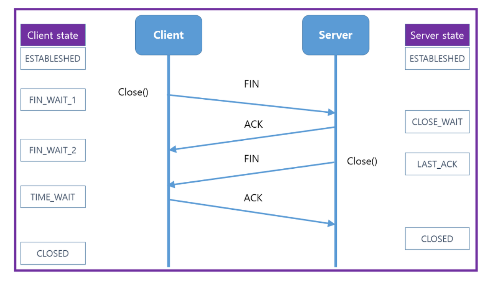

# 4-way Handshake

## TCP의 연결해제과정 : 4-way Handshake



1. 먼저 클라이언트가 연결을 닫으려고 할 때 FIN으로 설정된 세그먼트를 전송
   * 클라이언트는 `FIN_WAIT_1` 상태로 들어가고 서버의 응답을 대기
2. 서버는 클라이언트로 ACK라는 승인 세그먼트를 보내고 `CLOSE_WAIT` 상태에 들어감 
   * 클라이언트가 세그먼트를 받으면 `FIN_WAIT_2` 상태에 들어감
3. 서버는 `LAST_ACK` 상태가 되며 일정 시간 이후에 클라이언트에 FIN이라는 세그먼트를 전송
4. 클라이언트는 `TIME_WAIT` 상태가 되고 다시 서버로 ACK를 보내서 서버는 `CLOSED` 상태가 됨
   * 이후 클라이언트는 **어느 정도의 시간(TIME_WAIT으로 설정된 시간)을 대기한 후 연결이 닫힘**

<br><br>

## TIME_WAIT

소켓이 바로 소멸되지 않고 일정 시간 유지되는 상태  
지연 패킷 등의 문제점을 해결하는 데 쓰임   

`최대 세그먼트 수명(MSL) * 2배` 시간을 기다림   
기본적으로 MSL은 2분   

얼만큼 기다리는지는 OS마다 다름

* CentOS6, 우분투 : 60초로 설정 
* 윈도우 : 4분으로 설정

### 특징 
1. 지연 패킷이 발생했을 때 데이터 무결성(일관성, 정확성)을 해결하기 위함 - 전체적인 데이터를 받게 하기 위함  
   Ex. 지연 패킷 : 🚌버스 출발하려는데 달려오는 승객 기다려주기  

2. 연결을 올바르게 닫힌 상태로 만들기 위해 존재  
`CLOSED`가 아닌 `LAST_ACK`로 되어 있으면 그 다음 연결 때 오류 발생  


### 우분투 설정파일

```
include/net/tcp.h
#define TCP_TIMEWAIT_LEN (60*HZ) /* TIME-WAIT
```
