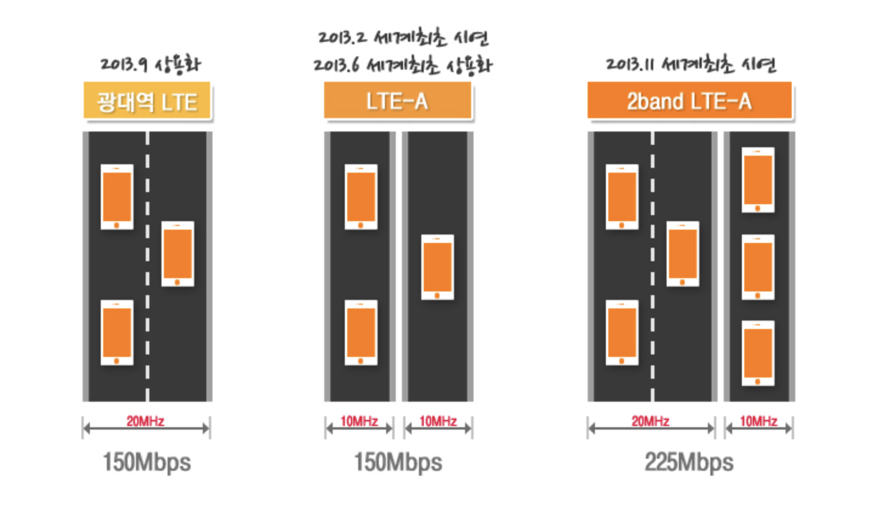
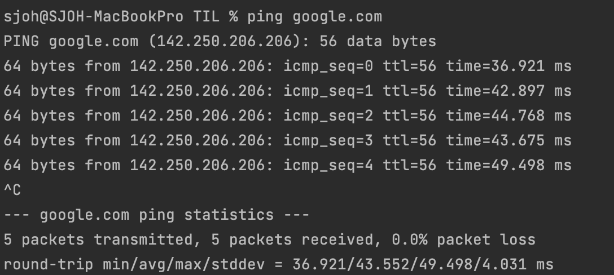

# 네트워크 기초

## 네트워크

노드(node)와 링크(link)가 서로 연결되어 있고 리소스를 공유하는 집합

- 노드 : 서버, 라우터, 스위치 등 네트워크 장치(스마트폰 등) 
- 링크(엣지) : 유선 또는 무선과 같은 연결매체 (Wi-Fi, LAN)

  

## 트래픽

트래픽은 특정시점에 링크 내의 **흐르는 데이터의 양**  
서버에 저장된 파일(문서, 이미지, 동영상 등)을 클라이언트(사용자)가 다운로드 시 발생되는 데이터의 누적량  

### 트래픽과 처리량 구분

- 트래픽이 증가 = 흐르는 데이터가 증가
- 처리량이 증가 = 처리되는 트래픽이 증가

 

### 예시

이미지나 동영상을 요청했을 때 서버에는 다음과 같은 트래픽이 발생
- 단위 : bps(bits per second)

> Q1. 100KB 이미지를 1,000명이 다운로드 시 누적 트래픽?  
  100KB x 1,000 = 100,000KB(100MB) 

> Q2. 10MB 동영상을 10명이 다운로드 시 누적 트래픽?  
  10MB x 10 = 100MB

  

##처리량

처리량(throughput)은 링크 내에서 성공적으로 전달된 데이터의 양   
보통 얼만큼의 트래픽을 처리했는지를 나타냄   

* 많은 트래픽을 처리 = 많은 처리량을 가짐 
* 단위 : bps(bits per second) 초당 전송 또는 수신되는 비트 수

처리량은 사용자들이 많이 접속할 때마다 커지는 트래픽, 네트워크 장치 간의 대역폭, 네트워크 중간에 발생하는 에러, 장치의 하드웨어 스펙에 영향을 받음

> ❓ 10만 명이 동시에 서비스에 접속할 경우  
> * 서버가 다운될 수 있음  
> * 트래픽 증가, 처리량 감소  
> * 대역폭이 좁을 경우 데이터를 동시에 많이 수신할 수가 없음 

  

## 대역폭
대역폭(bandwidth)은 주어진 시간 동안 네트워크 연결을 통해 흐를 수 있는 최대 비트 수, **최대 트래픽**  
대략적인 **최대 동시 접속자 수** 유추의 척도

고속도로의 차선이 많을 때 더욱 교통이 원활하듯이, 대역폭이 높을수록 사용자에게 빠른 서비스를 제공  

- 단위 : bps(bits per second) 초당 전송 또는 수신되는 비트 수

> Q. 100Mbps라는 대역폭을 가진 서버가 있고 한 사용자당 100kbps로 동영상 파일을 요청할 때, 최대 동접자수는?    
100Mbps / 100kbps = 약 1000명

  

## RTT
RTT(Round Trip Time : 왕복 지연 시간)는 신호를 전송하고 해당 신호의 수신확인에 걸린 시간을 더한 값    
어떤 메시지가 두 장치 사이를 왕복하는 데 걸린 시간

`전송` 800ms + `수신확인` 900ms = `⏰지연 시간` 1.7s

 

### 예시

터미널에 `ping google.com` 입력  
* ping : IP 네트워크를 통해 특정한 호스트가 도달할 수 있는지의 여부를 테스트하는 데 쓰이는 OS 명령어

* 패킷 전송, 수신, 손실 정보
* 최소, 평균, 최대 RTT 등을 알 수 있음

