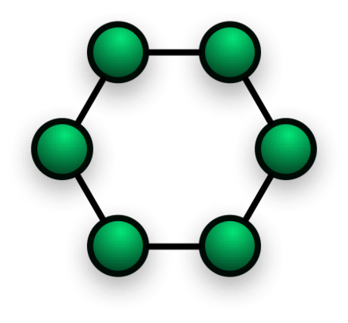
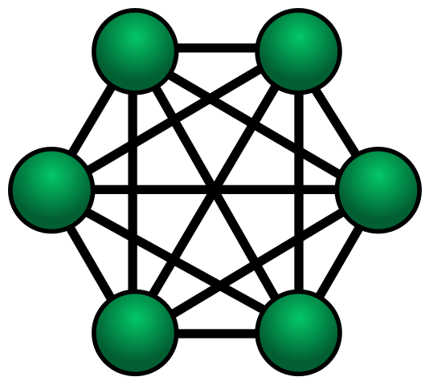

# 네트워크 기초

## 링형 토폴로지 

### 특징
- 고리 형태
- 노드 추가, 삭제 쉬움 (자료구조 연결 리스트와 비슷)

 

### 장점
- 노드 수가 많아져도 데이터 손실이 없음 
  - **토큰**을 기반으로 연속적으로 노드를 거치며 **통신권한 여부**를 따지고, 해당 권한이 없는 노드는 데이터를 전달받지 않음

 

### 단점
- 링크 또는 노드가 하나만 에러 발생해도 전체 네트워크에 영향 (🌉다리가 끊긴 것)
- 토큰이 없는 노드는 통신에 참여를 못하며, 데이터 공유가 안됨
  - 토큰이 장점이자 단점  

  

## 메시 토폴로지

### 특징
- 그물망 형태
- 노드 추가, 삭제 어려움
- 풀(full) 메시 토폴로지, 부분(partially connected) 메시 토폴로지가 존재 
  - 풀(full) 메시 토폴로지의 경우 n * (n-1) / 2의 회선이 필요

 

### 장점
- 안정성이 높음
  - 한 노드가 장애가 발생해도 다른 노드에 영향을 미치지 않음
- 회선이 많기 때문에 트래픽을 분산할 수 있음 

 

### 단점
- 회선이 비효율적으로 많기 때문에 구축 비용이 비쌈
