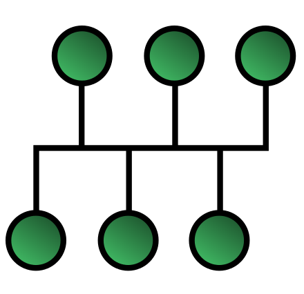
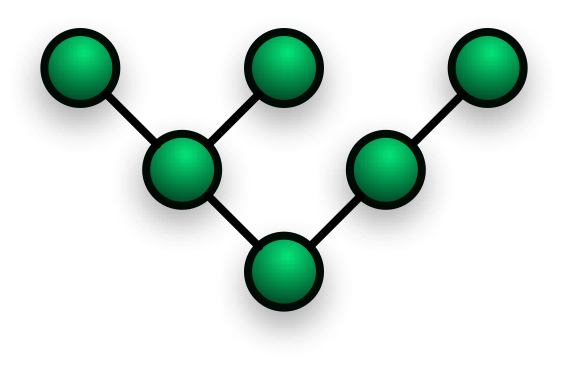

# 네트워크 기초

## 네트워크 토폴로지(topology)

노드와 링크가 어떻게 구성되어 있는지 연결 방식을 의미  

  

## 버스 토폴로지

### 특징
- 하나의 회선에 여러 개의 노드
- 노드 추가, 삭제 쉬움
- 설치비용 적음(하나의 회선)

 
 
### 장점
- 소규모 네트워크를 구축하기 매우 쉬움
- 한 노드에 장애가 발생해도 다른 노드에 영향 X

 

### 단점
- 메인 링크에 많은 트래픽이 생기면 정체 현상 발생 가능성 높음(패킷 손실율 높음)
- 하나의 회선에 의존하기 때문에, 메인 링크가 망가지면 큰 문제

  

## 스타 토폴로지

### 특징
- 중앙에 있는 노드를 기반으로 연결된 형태
- 노드 추가, 삭제 쉬움

 

### 장점
- 중앙노드가 아닌 한 노드에 장애가 발생해도 다른 노드에 영향 X
- 안정성이 높음
  - 중앙노드가 아닌 한 노드에 침해가 발생했을 때, 다른 노드로 확장하기가 어렵기 때문
  - 다른 노드로 가려면 중앙노드를 무조건 거쳐야 하는데, 보통의 스타 토폴로지는 중앙노드의 방화벽과 보안 등을 더욱 깐깐하게 해놓음
- 한 링크에 문제가 생겨도 해당 부분만 영향을 받고 나머지 부분은 정상적으로 작동

 

### 단점
- 중앙노드 에러 시 큰 문제

  

## 트리 토폴로지

### 특징
- 트리 형태(계층적 토폴로지)
- 노드 추가, 삭제 보통(가장 끝의 노드인 리프노드를 기반으로 확장은 용이, but 다른 노드는 어려움)
- 버스 토폴로지와 스타 토폴로지의 하이브리드 형태
- 트리 토폴로지는 백본 케이블을 기반으로 설계
  - 백본 케이블 : 대규모 패킷 통신망
    - 여러 소형 네트워크들을 묶어 대규모 파이프라인을 통해 극도로 높은 대역폭으로 다른 네트워크들의 집합과 연결되는 네트워크

 

### 장점
- 노드 확장이 용이(주로 리프노드로 확장함)
- 리프노드의 에러는 나머지 부분에 영향 X

 

### 단점
- 특정 노드 트래픽 집중시 하위노드에 영향
- 가장 상단의 루트노드에 문제가 생기면 전체 네트워크에 큰 문제
