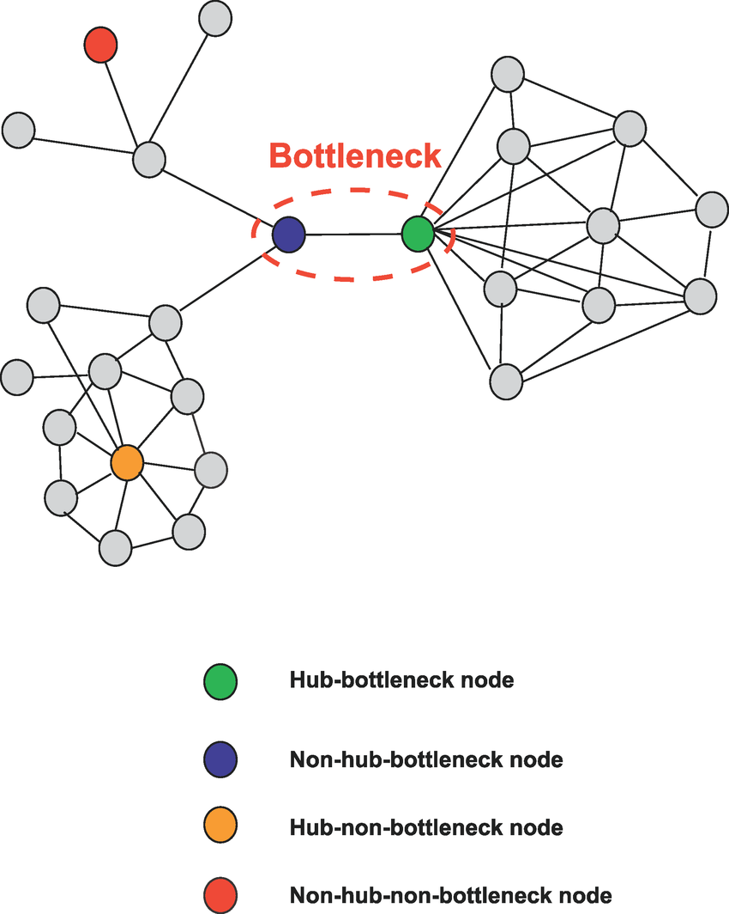

# 네트워크의 기초 

##병목현상

병목(bottleneck) 현상은 트래픽에 의해 데이터 흐름이 제한되는 상황  
핫스팟이라고도 함 (네트워크 한정)

  

## 네트워크 토폴로지의 필요성

토폴로지는 병목현상을 해결하는 척도

  

## 해결 사례

1. 트래픽이 몰려 서버가 다운되면, 자원의 양을 체크 (웹서버 메모리 증가 등)
2. 네트워크 토폴로지를 확인하고, 회선을 추가 

