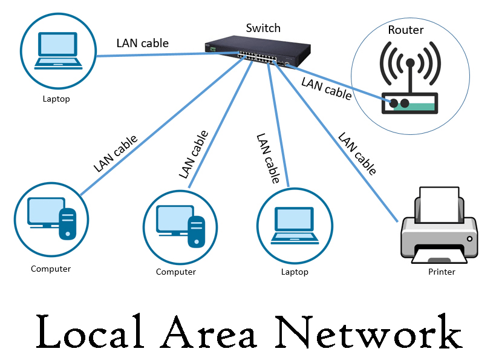
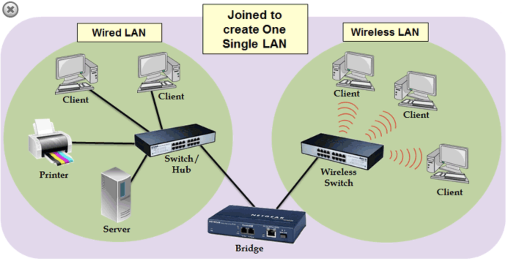
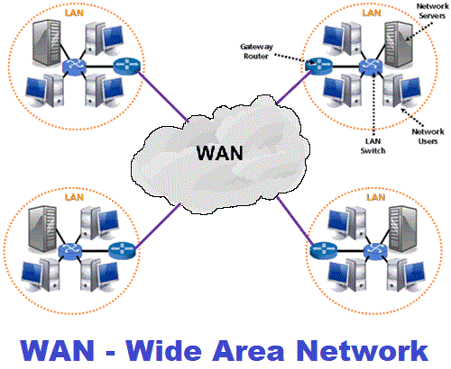

# 네트워크의 분류

네트워크는 LAN, MAN, WAN 순으로 분류  
LAN이 가장 작은 단위, WAN이 가장 큰 단위   
보통은 반경, 속도의 크기를 기반으로 분류

## LAN

Local Area Network, 근거리 통신망

MAN, WAN보다 높은 안정성과 속도  
소규모 네트워크(집, 사무실) - 보통 허브나 스위치로 연결  
하나의 논리적 주소인 **IP를 기반으로** 여러개의 물리적 주소인 **MAC 주소로 구별하는 네트워크**라고도 볼 수 있음.

* IP 주소 : 논리적 주소, 가변, Wi-Fi가 바뀌면 달라짐    
* MAC 주소 : 물리적 주소, 불변, 기기를 살 때 받는 고유번호
* NAT : 하나의 IP를 이용해 IP가 여러개인 척 하는 기술, 가상의 IP 할당, 내부적으로는 MAC 주소로 구별  

  

## MAN

Metropolitan Area Network, 대도시 통신망  

도시와 도시의 통신망을 뜻하며 2개 이상의 LAN이 연결되어 구성  
라우터, 브릿지(LAN끼리 연결하는 장치) 등으로 연결됨  

ex) 옷매장 사례 : 서울 매장에 없어도 대전 매장에서 재고를 찾을 수 있음  

  

## WAN

Wide Area Network, 광역 통신망

국가와 국가와의 통신망을 뜻하며 **인터넷**이라고도 함 (WAN으로 통신한다 = 인터넷으로 통신한다)     
많은 라우터를 거쳐 다른 국가와도 연결  
