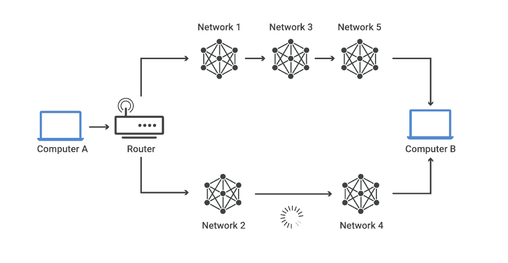
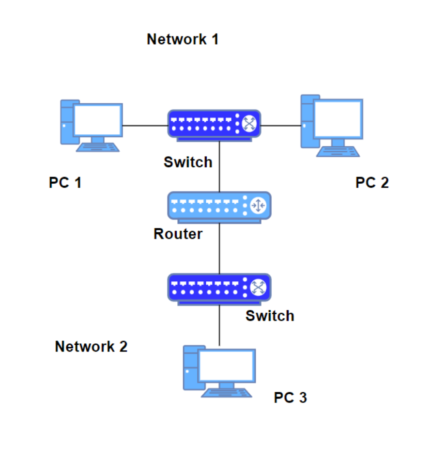

# 라우팅 

## 개념

라우팅(routing)은 네트워크에서 데이터(패킷)를 보낼 때 **최적의 경로를 선택하는 과정**이며 라우터가 이를 수행  
⚡️가장 빠른 최적의 경로를 찾아 요청을 빠르게 전달  
데이터는 보통 출발지에서 목적지로 가는 동안 여러개의 라우터를 거치며 여러번의 라우팅을 수행   
라우팅은 보통 초당 수백만번 발생  
Ex. 🚌대중교통 최적 방법 선택 

  

## 라우터

라우터는 네트워크 사이에서 데이터를 전달하는 장치  
보통 둘 이상의 서로 다른 네트워크에 연결됨  
데이터(패킷)를 목적지로 보낼 때 최적의 경로를 결정하고 경로가 결정되면 해당 경로로 데이터를 넘겨주는 일(라우팅)을 수행  
라우터는 라우팅테이블을 기반으로 데이터를 다음 목적지에게 전달  

