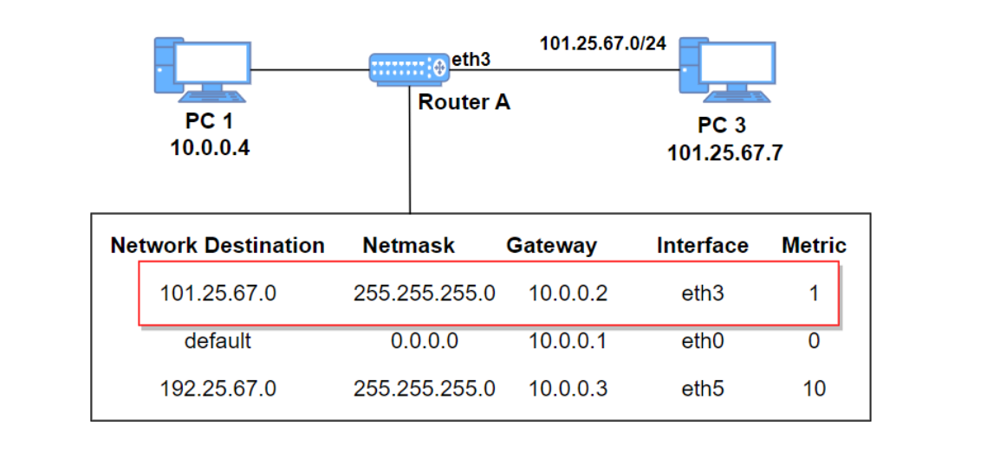
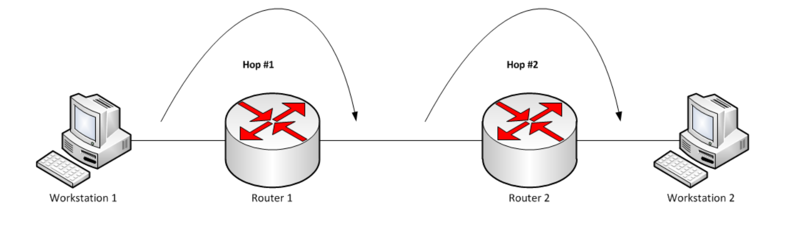

# 라우팅

## 라우팅 테이블

IP 주소를 기반으로 라우터의 위치를 저장한 테이블 또는 데이터베이스  
다양한 네트워크에 대한 정보와 해당 **네트워크에 연결하는 방법**이 포함되어 있음  



PC1(10.0.0.4)이 101.25.67.0 네트워크에 있는 PC3(101.25.67.7)에 패킷을 보내려고 할 때, 이 때 RouterA를 거쳐 전달

<br><br>

## 라우팅 테이블의 구성요소

- 네트워크 대상(Network Destination) : 목적지 네트워크의 IP 주소
- 서브넷 마스크(Netmask) : 대상 주소를 설명할 때 쓰이는 값
- 게이트웨이(Gateway): 이 장치와 연결되어있는 홉, 패킷이 전달되는 다음 IP 주소(외부 네트워크와 연결된 장치) 
  - 목적지가 로컬 네트워크라면 `연결됨(connected)`라고 표기 되며, 다른 네트워크라면 해당 네트워크의 게이트웨이를 가리킴
- 인터페이스(interface): 게이트웨이로 가기위해 거치는 장치 
  - 10.0.0.2는 eth3을 통해 접근이 가능
- 메트릭(Metric): 우선순위, 패킷 전송을 위해 최적의 경로가 선택되도록 참고되는 값
  - 동일한 라우팅테이블 요소가 2개 있을 때 이 값이 낮은 요소가 선택됨
  - 메트릭은 일반적으로 **홉 수(hop count)** 가 들어가며 지연시간, 처리량 등이 들어갈 수 있음 

<br><br>

## 게이트웨이

게이트웨이는 프로토콜 변환기라고도 하며 네트워크와 네트워크를 잇는 장치  
라우터 기능이 비슷  
외부 네트워크와 잇는 장치  

<br><br>

## 홉



홉(hop)은 네트워크에서 출발지와 목적지 사이에 위치한 장치  
홉 카운트(hop count)는 데이터가 출발지와 목적지 사이에서 통과해야 하는 홉의 개수  
라우팅을 `홉바이홉통신` 이라고도 부름

홉 카운트는 적은 것이 좋음  

<br><br>

## 라우팅 테이블 실습
```
netstat -r
```
