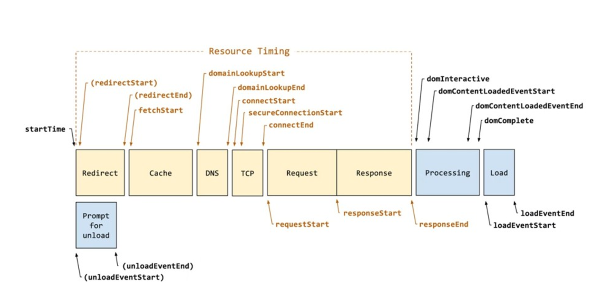
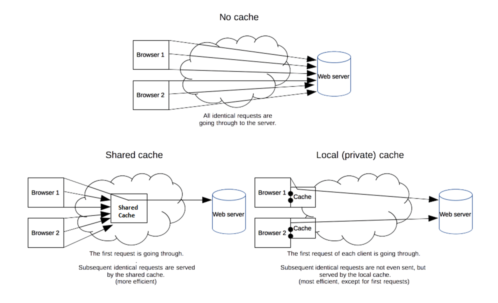
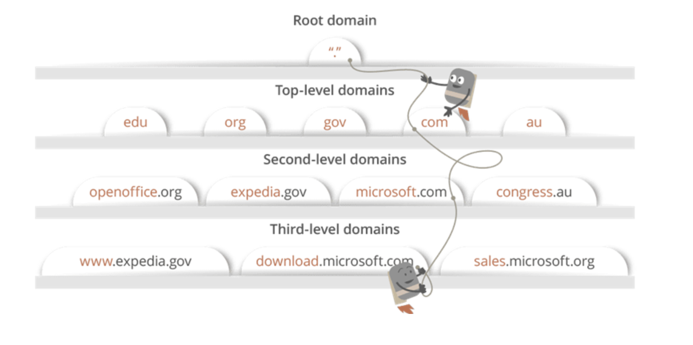

# 브라우저 렌더링 과정

## 브라우저 렌더링

> www.naver.com을 주소창에 입력했을 때 화면이 나타나기까지의 과정

대기열, 캐싱, DNS, 라우팅, ARP, 초기연결을 거쳐 콘텐츠를 다운받음  
이후 **브라우저 렌더링 과정**을 거쳐 화면이 나타남  
이러한 과정이 **캡슐화, 비캡슐화** 과정을 거쳐서 이루어짐  

  

## 대기열

브라우저는 주소창입력에 대한 요청을 대기열에 넣음

  

## 캐싱

캐싱은 요청된 값의 결과값을 저장하고, 그 값을 다시 요청하면 제공하는 기술   
요청이 왔을 때 캐시를 확인하고, 캐시를 기반으로 작업 
 
`브라우저 캐시`와 `공유 프록시 캐시`로 나뉨

### 1. 브라우저 캐시

로컬, 프라이빗 캐시  
쿠키, 로컬스토리지 등을 포함  
브라우저 자체가 사용자가 HTTP를 통해 다운로드하는 모든 문서를 보유하는 것 

Ex. 어떤 사이트를 재방문했을 때 빠르게 콘텐츠가 나타나는 것     
인터넷 사용기록을 삭제할 때 -> 쿠키 및 기타 사이트 데이터, 캐시

### 2. 공유 프록시 캐시

요청한 서버에서 프록시 서버가 캐싱을 하는 것     

Ex. Node.js로 서버를 구축한다면 앞단의 프록시 서버로 nginx 서버를 둬서 이 서버를 캐싱 서버로도 사용할 수 있음

  

## DNS

브라우저가 요청의 IP 주소를 확인하는 단계   
DNS는 도메인 이름과 IP 주소를 매핑해주는 서버

Ex. www.naver.com 에 DNS 쿼리가 오면 오른쪽부터 역순으로 [Root DNS]→ [.com DNS] → [.naver DNS] → [.www DNS] 과정을 거쳐 완벽한 주소를 찾아 IP 주소를 매핑

바로 DNS서버로 요청을 전달하는 것은 아니고,
먼저 컴퓨터 메모리에 있는 호스트 파일 등 `캐시를 확인`한 후,
캐시미스(캐시가 없을 때)가 일어나면 DNS서버로 요청

  

## IP 라우팅

`IP 라우팅, ARP 과정(MAC 주소 찾기 과정)`을 거쳐 실제 서버를 찾음 

  

## 초기 연결

브라우저가 `TCP 3-way Handshake` 및 `SSL 연결` 등을 통해 연결을 설정   
요청을 보낸 후 해당 요청한 서버로부터 응답을 받음(Ex. 네이버 등)

  

## 콘텐츠 다운로드

브라우저는 서버로부터의 `응답`을 수신

  

## 브라우저 렌더링

받은 데이터를 바탕으로 브라우저 엔진이 `브라우저 렌더링 과정`을 거쳐 화면을 그림 

