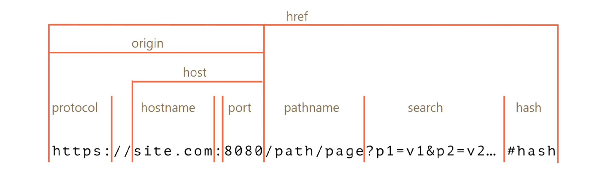
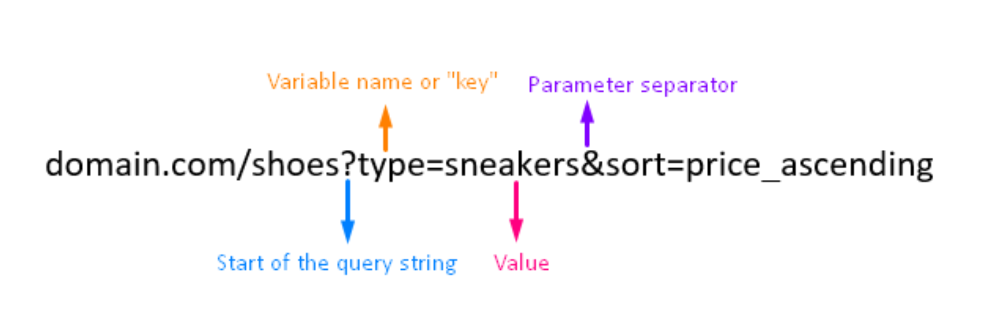

# 웹브라우저 캐시

## 로컬스토리지

로컬스토리지는 웹 스토리지 객체로 브라우저 내에 { key : value } 형태로 오리진에 종속되어 저장되는 데이터  
오리진이 같은 브라우저 내에서 공유됨  

 

## 오리진 

**오리진 = 프로토콜 + 호스트 네임 + 포트** 

* search 또는 보통 query string
* 포트 번호는 생략 가능 
  * https 기본 포트번호 443
  * http 기본 포트번호 80 

 

### 예시

> 오리진이 같은 두 사이트에서 로컬스토리지는 공유됨  
> https://search.shopping.naver.com/search/all?query=가방&cat_id=&frm=NVSHATC    
> https://search.shopping.naver.com/search/all?query=신발&cat_id=&frm=NVSHATC  
