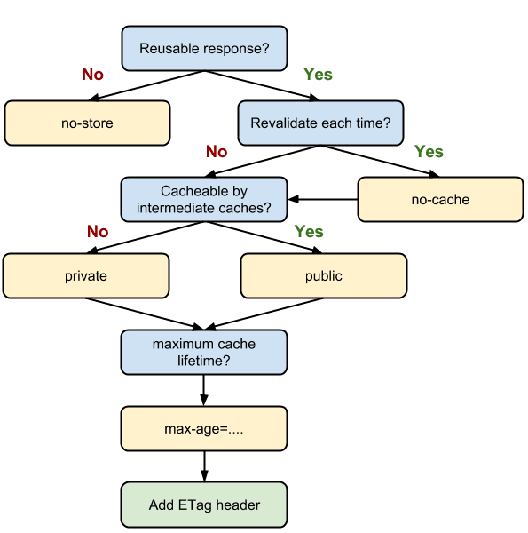
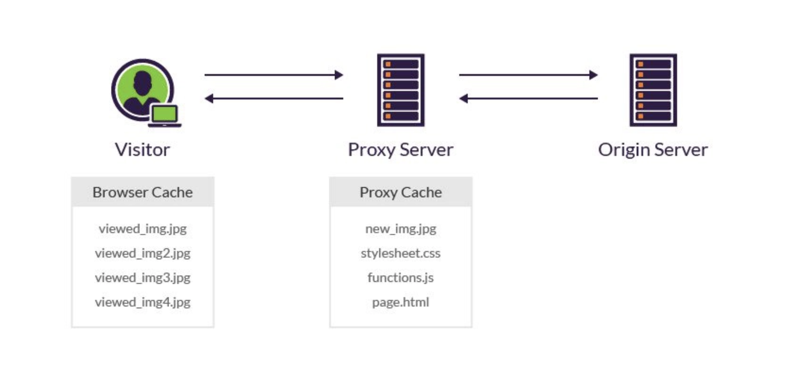

# 캐싱

## 캐싱 개념

웹사이트 성능을 높이기 위해 필수적인 방법  
파일 복사본을 `캐시` 또는 `임시 저장 위치`에 저장하여 보다 빠르게 액세스할 수 있도록 하는 프로세스

### 주의점 

* stale한 데이터를 보여주게 될 수 있음  
* 비싼 저장공간 때문에 부담되는 비용

<br><br>

## 웹 캐시

> 웹 캐시(web cache), HTTP 캐시(HTTP cache), 브라우저 캐시(browser cache)   

서버 지연을 줄이기 위해 웹 페이지, 이미지, 기타 웹 멀티미디어 등의 웹 문서들을 임시 저장하기 위한 방법 

브라우저나 HTTP 요청을 하는 클라이언트 애플리케이션에 의해 내부 디스크에서 이루어지는 캐시    
-> **사설 캐시**(Private Cache), 단일 사용자를 대상으로 하며 해당 사용자의 정보만을 저장

이전에 불러온 적 있는 데이터이고, 거의 바뀔 일이 없는 데이터라면 캐싱을 적용해 볼 수 있음   
브라우저에서 캐싱을 처리하는 속성에는 `ETag`, `Cache-Control` 등이 존재 

#### 웹 캐시 시스템 

1. 웹 캐시 시스템을 통과하는 **문서의 사본을 저장**
2. 이후 요청들은 **특정 조건을 충족하는 경우 캐시화**가 가능

동일한 서버에 다시 접근할 때에는 근처에 있는 `프록시 서버`의 `웹 캐시`에 저장된 정보를 불러오므로 
더 빠른 열람이 가능

<br>

### Nginx

> 웹 캐시 소프트웨어

[nginx](https://nginx.org/en/)

Nginx(엔진 x)는 웹 서버 소프트웨어로, 가벼움과 높은 성능이 목표  
웹 서버, 리버스 프록시 및 메일 프록시 기능을 가짐

<br>

### ETag (Entity Tag)

> 브라우저에서 캐싱을 처리하는 속성

**ETag HTTP 응답 헤더**는 특정 버전의 리소스를 식별하는 식별자  
웹 캐시 유효성 검증에 사용됨   

* 웹 서버가 내용을 확인하고 **변화가 없으면** 웹 서버로 full 요청을 보내지 않음 -> 캐쉬가 더 효율적이고, 대역폭도 아낄 수 있음
* **내용이 변경되었다면**, `mid-air collisions`이라는 리소스 간의 동시다발적 수정 및 덮어쓰기 현상을 막는데 유용하게 사용됨

특정 URL의 리소스가 변경된다면, 새로운 ETag가 생성됨   
ETag는 지문과 같은 역할을 하면서, 다른 서버들이 추적하는 용도에 이용되기도 함   
ETag를 비교해서 리소스가 서로 동일한지 빠르게 판단할 수 있지만, 서버에서 **무기한으로 지속**되도록 설정할 수도 있음 

<br>

#### 1. 충돌 피하기 (mid-air collisions)

ETag와 HTTP헤더의 `If-Match`를 이용해 충돌을 예측 

```bash
# Ex. MDN을 편집할 때, 현재 위키 콘텐츠는 해시되어 Etag 안에 들어감 

ETag: "33a64df551425fcc55e4d42a148795d9f25f89d4
```

```bash
# 위키 페이지에 변경사항을 저장할 때, POST 요청은 If-Match 헤더에 새로운 변경사항이 발생했는지 판별하기 위해,  
# 기존의 ETag값을 포함하여 요청을 진행

If-Match: "33a64df551425fcc55e4d42a148795d9f25f89d4"
```

해시가 일치하지 않으면, **문서가 변경되었다**는 의미이며 `412 Precondition Failed` (전제조건 실패) 에러를 던짐

<br>

#### 2. 변경되지 않은 리소스의 캐싱

사용자가 URL을 재방문 했을 때(ETag를 가지고 있는 상태에서), 보유한 ETag가 너무 오래되어 사용될 수 없다고 판단될 경우  
-> 클라이언트는 `If-None-Match` 헤더 필드에 ETag를 전송

```
If-None-Match: "33a64df551425fcc55e4d42a148795d9f25f89d4"
```

서버는 클라이언트의 ETag를 현재 버전 리소스의 ETag와 비교하고, 
두 값이 일치하는 경우(리소스에 변경이 없는 경우) `304 Not Modified` 상태를 반환  
-> **캐시된 버전이 여전히 유효하다**는 것을 클라이언트에게 알려줌 

<br>

#### If-Match

If-Match HTTP 요청 헤더는 요청을 조건부로 만듦

* 서버는 리소스가 ETag에 나열된 값 중 하나와 `일치하는 경우`,
  * `GET`, `HEAD` 메소드에 대해 요청된 리소스만 반환하거나
  * `PUT`이나 기타 안전하지 않은 메소드에 대한 리소스를 업로드 
* 조건이 `일치하지 않으면` 412(전제 조건 실패) 응답이 반환됨 

#### If-None-Match

`If-None-Match` HTTP 요청 헤더는 요청을 조건부로 만듦

* `GET`, `HEAD` 메소드의 경우, 서버는 요청된 리소스에 주어진 값과 `일치하는 ETag가 없는 경우에만(리소스에 변경이 있는 경우)` 200 상태와 함께 요청된 리소스를 반환
* `GET`, `HEAD` 메소드에서 `조건이 실패하면(리소스에 변경이 없는 경우)` 서버는 HTTP 상태 코드 304(Not Modified)를 반환 
  
<br>

### Cache-Control

> 브라우저에서 캐싱을 처리하는 속성

Cache-Control 일반 헤더 필드  
요청과 응답 내의 캐싱 메커니즘을 위한 디렉티브를 정하기 위해 사용  
캐싱 디렉티브는 **단방향성**  
-> `요청 내에 주어진 디렉티브`가 `응답 내에 주어진 디렉티브`와 동일하다는 것을 의미하지는 않음 

성능 관점에서는 `서버와 통신하지 않는` 코드가 가장 좋음     
-> 요청을 보낼지 여부를 판단할 때 **HTTP 헤더의 Cache-Control** 요소로 캐싱을 제어할 수 있음 

<br>

#### no-cache

> ✅ 캐시를 먼저 사용하기 전에, 서버에 해당 캐시를 사용해도 되는지 검증 요청을 보내는 속성   
> ⚠️ 캐시를 쓰지 않는다는 속성이 아님

* `no-cache` 속성이 없는 경우 : 캐시가 있다면 바로 캐시를 사용 
* `no-cache` 속성이 있는 경우 : 캐시를 바로 쓰지 않고, 서버에 이 캐시를 써도 되는지 허락을 맡고 사용
  * -> 요청에 대한 시간이 소요될 수 있음
  
<br>

#### no-store

> ✅ 캐시를 쓰지 않는다는 말에 더 가까운 속성   
> 캐시는 클라이언트 요청, 서버 응답에 관해서 어떤 것도 저장해서는 안됨 

no-store 속성을 사용하면 반환된 응답에 대해 **브라우저가 캐싱을 하지 않음**   
매번 요청을 보낼 때마다 전체 데이터를 받아오는 식으로 처리  
-> 개인정보 등 `private`한 데이터가 있는 경우 이 속성을 사용할 수 있음 

<br>

#### private, public

* `public`은 **캐싱이 가능**하다는 의미
* `private`은 응답을 캐싱하는 과정에서 **엔드 유저만 캐싱이 가능**하고, 그 가운데 거치는 매개체에서는 캐싱할 수 없는 속성 
  * 사설 캐시(Private Cache, Browser Cache), 로컬 캐시 
  * 단일 사용자의 **개인화된 콘텐츠**에만 재사용되는 캐시 
  * ↔️ `사설 캐시`에 반대되는 개념이 `공유 캐시(Shared Cache)`

<br>

### 브라우저의 Cache-Control 플로우 차트 



<br><br>

## 프록시 캐시



> 공유 캐시(Shared Cache)

한 명 이상의 사용자에 의해 재사용되는 응답을 저장

대표적으로 `ISP`(Internet Service Provider)에서 **많이 조회되는 리소스를 재사용**하기 위해 웹 프록시를 설치했을 수 있음 

> Ex. 구글에 접속할 때, 미국의 구글 서버에서 매번 데이터를 불러오려면 많은 시간이 소요   
> 프록시 캐시를 이용해 구글 사이트에 관한 리소스를 한국 서버에 둘 수 있음 

### 프록시 서버  

클라이언트가 자신을 통해서 다른 네트워크 서비스에 간접적으로 접속할 수 있게 해주는 시스템이나 프로그램

* 프록시 : 서버-클라이언트 사이에 중계기로서 대리로 통신을 수행하는 것
* 프록시 서버 : 중계 기능을 하는 것 

1. 프록시 서버 중 일부는 프록시 서버에 요청된 내용들을 캐시를 이용하여 저장   
2. 이렇게 캐시를 해둔 후, 캐시 안에 있는 정보를 요구하는 요청이 있을 경우
3. 원격 서버에 접속하여 데이터를 가져올 필요가 없게 됨   
   -> 전송 시간을 절약, 불필요하게 외부와의 연결을 하지 않아도 됨  
   -> 외부와의 트래픽을 줄여, 네트워크 병목 현상을 방지

<br>

### 캐시 무효화 

프록시 캐시에서도 `브라우저 캐시`처럼 `Cache-Control` 속성이 있으며, 여기에서 캐시에 관한 설정을 지시   
💡 프록시 캐시의 경우, **캐시 무효화**를 신경써야 함

클라이언트에서 캐시를 적용하지 않았는데, 브라우저가 임의로 캐싱한다면 업데이트가 되지 않아 문제가 발생할 수 있음  
-> **캐시를 무효화**해야함 

#### 캐시 무효화 옵션

`no-cache`, `no-store`, `must-revalidate`  

캐시가 만료된 후 최초 조회할 때 **원 서버에 검증**을 반드시 거쳐야 함  
-> 원 서버에 접근이 안 된다면 `504 Gateway Timeout` 에러가 발생  

캐시가 저장한 데이터를 사용할 때 `stale`(최신화가 필요한)이라는 표현을 사용  
stale한 데이터를 쓰고 싶지 않을 때 `must-revalidate` 속성을 사용

* `no-cache`와의 차이점 
  * 프록시 캐시 서버와 원 서버 사이의 네트워크 단절이 일어난 경우에 발생 
    * `no-cache`는 stale한 데이터라도 보여주어야 할 때 사용 
    * `must-revalidate`는 stale한 데이터를 사용해서 문제가 발생할 때 사용 (504 에러를 반환)

> ❓ no-cache, must-revalidate를 추가하는 이유
>
> HTTP 1.1을 지원하지만 조금 오래된 브라우저와의 호환, 버그      
> 수 많은 프록시 캐시 업체들과 그 구현 서버 등의 문제 때문에
> `no-store`만으로 해결하지는 못하고, 나머지 옵션들도 함께 사용  
> 구글이나 네이버 등 주요 메이저 사이트의 응답을 보면 `cache-control: no-cache, no-store, must-revalidate`를 함께 가져감

<br><br>


## 프론트엔드 데이터 패칭 라이브러리

* SWR
* React-Query
* apollo-client

<br><br>

## 참고 사이트 

> 웹 캐시 https://ko.wikipedia.org/wiki/%EC%9B%B9_%EC%BA%90%EC%8B%9C  
> ETag https://developer.mozilla.org/ko/docs/Web/HTTP/Headers/ETag  
> Cache-Control https://developer.mozilla.org/ko/docs/Web/HTTP/Headers/Cache-Control   
> 프록시 서버 https://ko.wikipedia.org/wiki/%ED%94%84%EB%A1%9D%EC%8B%9C_%EC%84%9C%EB%B2%84    
> CDN https://ko.wikipedia.org/wiki/%EC%BD%98%ED%85%90%EC%B8%A0_%EC%A0%84%EC%86%A1_%EB%84%A4%ED%8A%B8%EC%9B%8C%ED%81%AC    
> Nginx https://ko.wikipedia.org/wiki/Nginx  
> https://stackoverflow.com/questions/49547/how-do-we-control-web-page-caching-across-all-browsers
