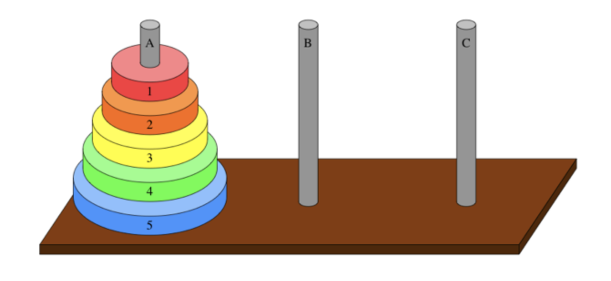
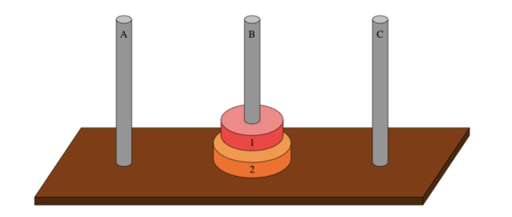

# 하노이 탑

## 하노이 탑 게임

한 기둥에 꽂힌 원판들을 그 순서 그대로 다른 기둥으로 옮겨서 다시 쌓는 것

<br>



<br>

### 규칙

1. 한 번에 한개의 원판만 옮길 수 있다.
2. 가장 위에 있는 원판만 이동할 수 있다.
3. 큰 원판이 작은 원판 위에 있어서는 안 된다.

<br>

### 방법 : 재귀함수 하향식 접근

원반 3개, ABC 기둥 3개로 가정

`스택` : 후입 선출 LIFO(Last In First Out)

3️⃣ [원반 1] -> 기둥 C (하위 문제)  
2️⃣ [원반 2, 1] -> 기둥 B  
1️⃣ [원반 3] -> 기둥 C

<br>



<br>

위 그림 상태에 이어서

2️⃣ [원반 1] -> 기둥 A (하위 문제)  
1️⃣ [원반 2] -> 기둥 C

<br><br>

## 코드 구현

### 풀이

```js
function hanoi(count, from, to, temp) {
    if (count === 0) return;  // 기저 조건
    
    hanoi(count - 1, from, temp, to);
    console.log(`원반 ${count}를 ${from}에서 ${to}로 이동`);
    hanoi(count - 1, temp, to, from);
}

hanoi(3, "A", "C", "B");  // 3 = 원반 갯수, from A to C, temp B
```

<br>

### 결과 

```md
원반 1를 A에서 C로 이동
원반 2를 A에서 B로 이동
원반 1를 C에서 B로 이동
원반 3를 A에서 C로 이동
원반 1를 B에서 A로 이동
원반 2를 B에서 C로 이동
원반 1를 A에서 C로 이동
```
