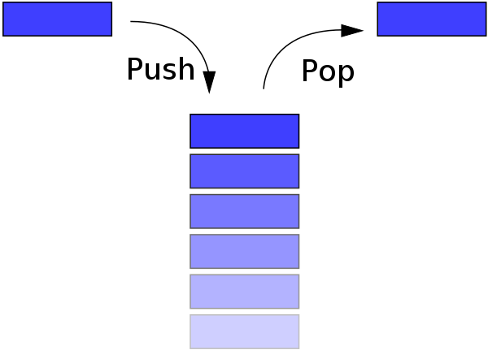

# 스택

## stack

단순한 규칙을 가진 선형 자료구조   
제한적으로 접근할 수 있는 나열 구조

<br><br>

## 후입 선출

### LIFO(Last In First Out)  

<br>



<br>

### 예시

* 설거지 먼저 끝난 그릇이 아래 쌓이고, 나중에 쌓인 그릇 먼저 사용
* 엘리베이터를 늦게 탄 사람이 먼저 내림
* 포토샵 되돌리기 버튼(ctrl Z)으로 바로 이전 상태로 되돌리기

<br><br>

## 코드

### 배열로 구현하기

자바스크립트 배열에 존재하는 push, pop 메소드 사용  
JS 배열은 크기가 유연하게 증감  
💡 배열의 단점인 중간 요소의 추가, 삭제가 사용되지 않아 구현이 유리   

```js
const stack = [];

// push
stack.push(1);
stack.push(2);
stack.push(3);
console.log(stack); // [1, 2, 3]

// pop
stack.pop();
console.log(stack); // [1, 2]

// get top
console.log(stack[stack.length -1 ]) // 2
```

<br>

### 연결 리스트로 구현하기

C언어, 자바 등의 언어에서 스택의 크기가 고정되지 않는 경우, 유한한 배열 대신 연결 리스트 사용  
연결 리스트의 head가 top

```js
class Node {
    constructor(value) {
        this.value = value;
        this.next = null;
    }
}

class Stack {
    constructor() {
        this.top = null;
        this.size = 0;
    }

    push(value) {
        const node = new Node(value);
        node.next = this.top;
        this.top = node;
        this.size += 1;
    }

    pop() {
        const value = this.top.value;
        this.top = this.top.next;
        this.size -= 1;
        return value;
    }

    size() {
        return this.size;
    }
}

const stack = new Stack();
stack.push(1);
stack.push(2);
stack.push(3);
console.log(stack.pop()); // 3
stack.push(4);
console.log(stack.pop()) // 4
console.log(stack.pop()) // 2
```


