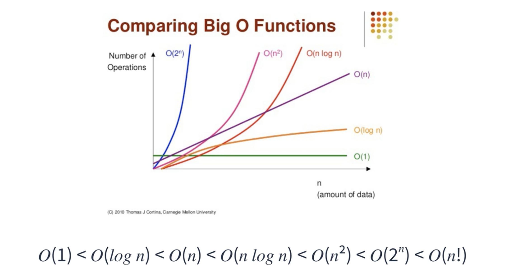
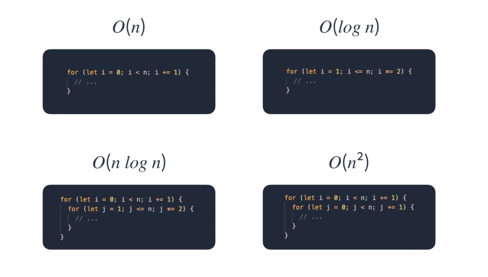

# 시간 복잡도

## 프로그램의 성능 측정

측정 시 고려할 것
* 입력 크기
* 하드웨어 성능
* 운영체제 성능
* 컴파일러 최적화
* 비동기 로직

<br>

항상 같은 데이터, 환경에서 측정해도 비슷한 결과는 나오지만 같은 결과는 X  
⚠️ 프로그램의 성능을 정확히 파악하는 것은 불가능

<br><br>

## Big-O 표기법

시간 복잡도를 나타내기 위한 방법  
프로그램의 대략적인 성능을 비교하기 위한 상대적인 표기법  



n이 전부 동일 값이라고 가정 시, O(1)이 가장 빠르고, O(n!)이 가장 느림  

<br>

### Big-O 표기법 코드 



* O(n) 선형 시간 : 입력받은 크기만큼 루프
* O(log n) 로그 시간 : 입력받은 n에 log를 씌운 만큼 루프
* O(n log n) 선형 로그 시간 : 선형 시간에 로그 시간을 곱한 시간
* O(n²) 이차 시간 : n의 제곱 만큼 루프
* O(2ⁿ) 지수 시간
* O(n!) 팩토리얼 시간

⚠️ 지수 시간, 팩토리얼 시간은 특별한 상황이 아니면 가급적 사용되어선 안됨

<br><br>

##  Big-O 표기법 법칙

### 계수 법칙

n이 무한에 가까울수록 k의 크기는 의미가 없기 때문에 생략  
k가 클수록 실제 성능에는 영향을 미칠 수 있음 

<br>

### 합의 법칙

빅오끼리는 더해질 수 있음

<br>

### 곱의 법칙

빅오끼리는 곱해질 수 있음  
이차시간, 선형 로그 시간 등이 곱의 법칙을 통해 나온 것

<br>

### 다항 법칙

다항식일 때 표기하는 방법

<br>

### 📌 Big-O 표기 시 꼭 기억할 것

1. 상수항은 무시
2. 가장 큰 항 외엔 무시

<br><br>

## 자바스크립트 성능 측정 방법

### Date 객체 이용

```js
const start = new Date().getTime();

// ...

const end = new Date().getTime();
console.log(end - start); // 로직 작동 시간을 알 수 있음
```

대략적인 성능 측정 가능
