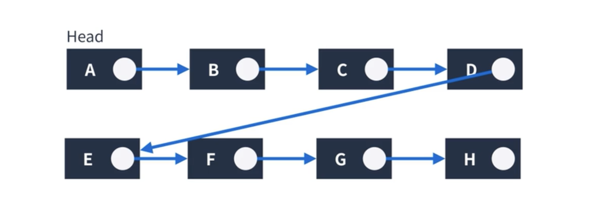
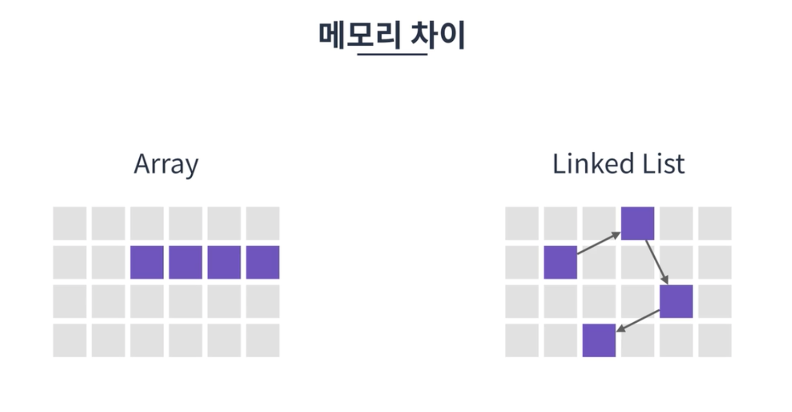
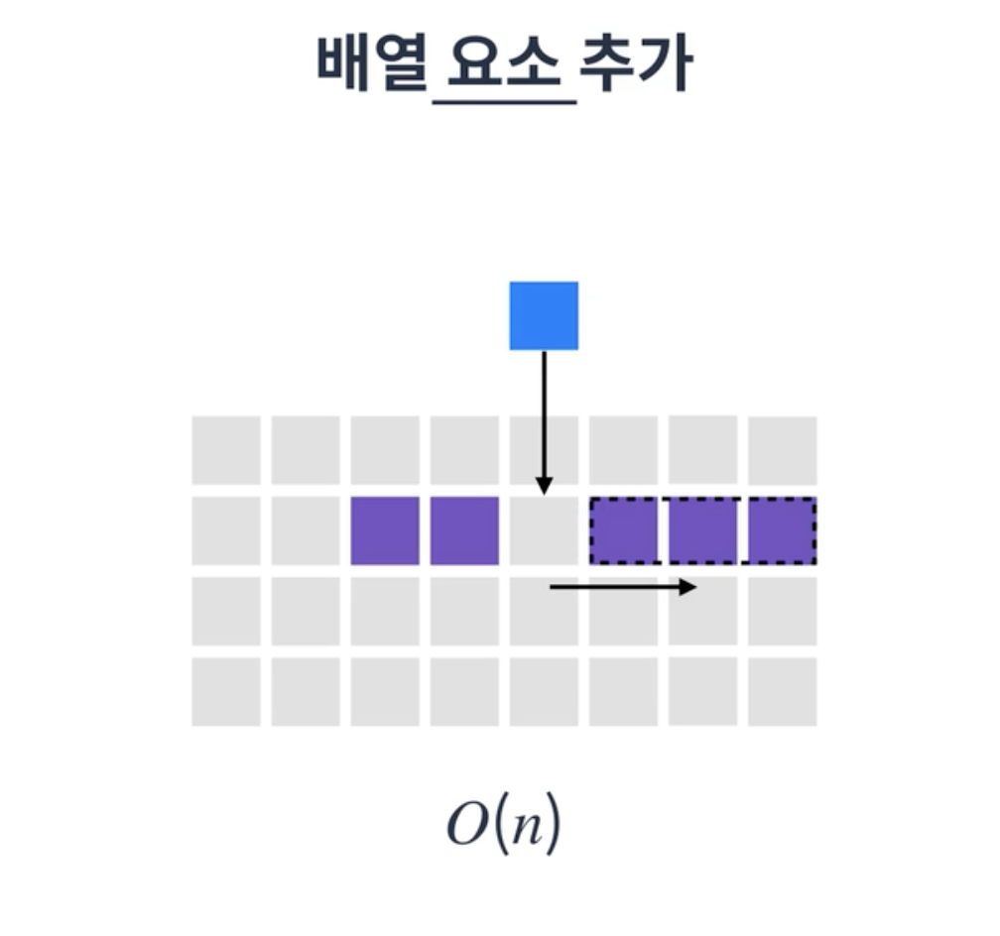
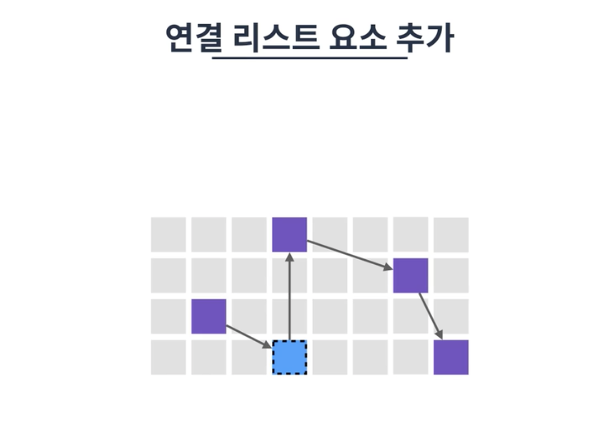

# 연결 리스트

## linked list

배열의 단점을 극복하는 방법  
💡배열은 탐색에 유리

> **배열의 단점**
> * 데이터의 추가, 삭제가 비효율적 -> 시간 복잡도가 커짐 
> * 크기 예측이 힘들기 때문에 메모리 낭비가 발생할 수 있음

저장하려는 데이터들을 메모리 공간에 분산해 할당하고, 각 요소를 포인터로 연결해서 관리하는 선형 자료구조    
각 요소는 **노드(Node)** 라고 부름  
데이터 영역과 포인터 영역으로 구성됨    

### 노드 

* 데이터 영역 : 해당 노드의 값 (A, B, C 적힌 영역)
* 포인터 영역 : 다음 노드를 가리키는 역할 (동그란 원 영역)

 

`Data` 데이터를 담는 변수 하나  
`Next` 다음 노드를 가리키는 변수 하나

필요한 데이터만큼 노드를 만들어 데이터를 저장하고, 다른 노드를 가리켜 연결  
=> `연결 리스트`

첫 노드의 주소만 알고 있으면 다른 모든 노드에 접근 가능  
`연결` 특성 떄문에 배열과 다른 장단점을 가짐

  

## 특징 

배열과 상반된 특징  

* 메모리가 허용하는 한, 요소를 제한없이 추가 가능
* 탐색은 O(n) 선형 시간이 소요됨
* 요소를 추가, 삭제할 때 O(1) 상수 시간이 소요됨
* singly linked list(단일), doubly linked list(이중), circular linked list(원형)가 존재

  

### 장점

* 초기 크기를 알지 못해도 됨
    * 빈 메모리 공간 아무 곳에 데이터를 생성하고 연결만 해주면 되기 때문
* 데이터의 삽입, 삭제가 편리
    * 다음에 가리키는 노드 순서만 바꿔주면 됨

  

### 단점

* 데이터가 전부 떨어져 있기 때문에 바로 접근할 수 없음

  

## 배열과 연결 리스트

 

|         |      배열       |   연결 리스트   |
|:-------:|:-------------:|:----------:|
|   크기    |      고정       |     동적     |
| 메모리(주소) |      연속       |    불연속     |
| 데이터 참조  |  O(1) 상수 시간   | O(n) 선형 시간 |
| 추가, 삭제  |  O(n) 선형 시간   | O(1) 상수 시간 |

 

* 데이터의 수가 자주 바뀌지 않고, 참조가 자주 일어날 경우 -> `배열`
* 데이터의 삽입과 삭제가 자주 일어나서 데이터의 수가 계속 바뀔 경우 -> `연결 리스트`
