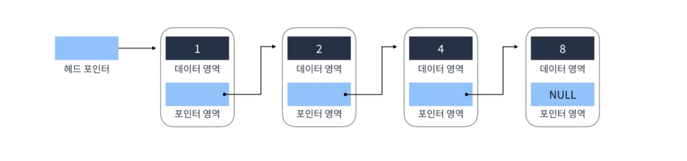
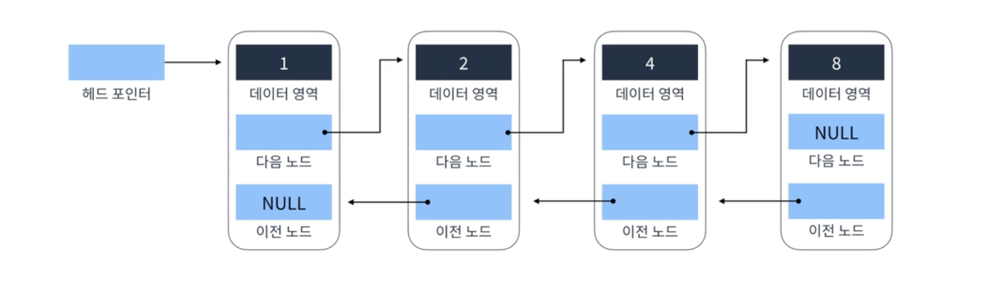
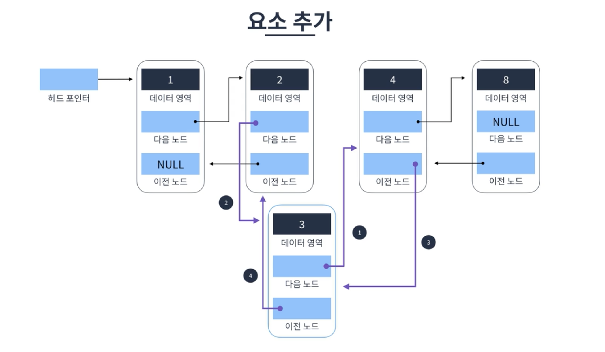
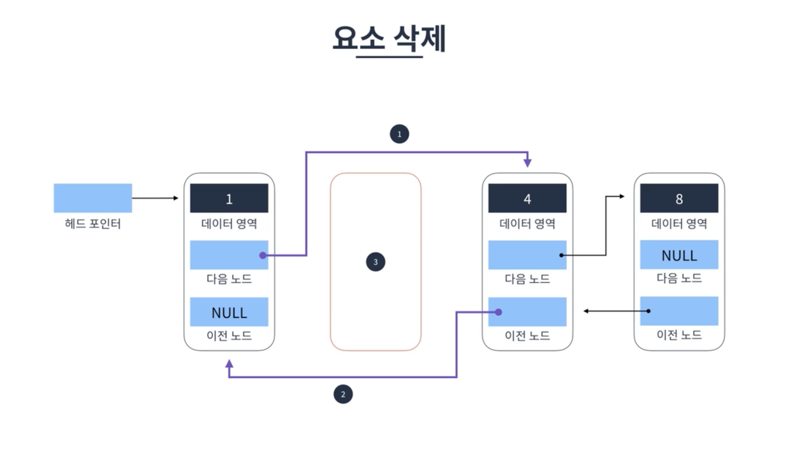
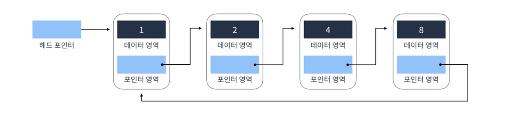

# 연결 리스트

## 단일 연결 리스트 singly linked list

Head에서 Tail까지 단방향으로 이어지는 연결 리스트   
가장 기본적, 단순한 형태의 연결 리스트 

* `Head` 첫 번째 요소
* `Tail` 마지막 요소 - 포인터 영역이 null이면 연결 리스트의 끝

### 요소 탐색

O(n) 선형 시간 소요

### 요소 추가

O(1) 상수 시간 소요  
⚠️탐색 로직을 같이 실행하면 O(n) 선형 시간 소요   

### 요소 삭제

O(1) 상수 시간 소요

  

## 이중 연결 리스트 doubly linked list

양방향으로 이어지는 연결 리스트  
단일 연결 리스트보다 자료구조의 크기가 조금 더 큼 (포인터가 하나 더 추가되었기 때문) 

### 요소 추가

O(1) 상수 시간 소요  

### 요소 삭제

O(1) 상수 시간 소요

  

## 원형 연결 리스트 circular linked list

단일, 이중 연결 리스트에서 Tail이 Head로 연결되는 연결 리스트  
메모리 절약  
원형 큐 등을 만들 때도 사용  

  

