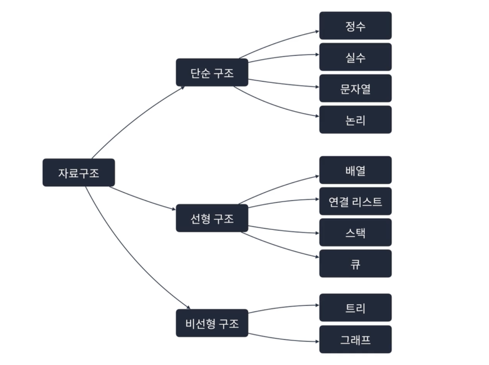
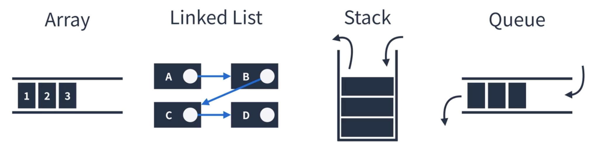
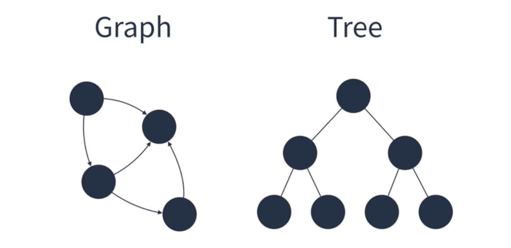

# 자료구조의 종류

## 자료구조

메모리를 효율적으로 사용하며 빠르고 안정적으로 데이터를 처리하는 것이 궁극적인 목표  
상황에 따라 유용하게 사용될 수 있도록 **특정 구조**를 이룸   
⚠️ 잘못 사용하면 메모리를 비효율적이게 사용하고, 느리고 불안정할 수 있음  
💡 **상황에 맞는 적절한 자료구조 선택하기**

Ex. Stack, Queue, Graph, Tree 등

* 큐: 줄서기
* 해시 테이블: 사물함

  

## 전산화

자료구조는 일차원인 컴퓨터 메모리를 현실에 대응되도록 구조를 만든 것

### 예시

> Q. 현실에서의 영화 예매를 컴퓨터로 옮기기

* 현실에서 수행되는 프로세스
  * 고객은 어떤 영화를 볼 지 고른다
  * 고객은 영화를 예매하기 위해 줄을 선다
  * 고객은 차례가 왔을 때 좌석을 선택한다
  * 고객은 돈을 지불한다

 

* 소프트웨어에서 처리 방법
  * 영화를 검색한다 ➡️ Trie
  * 고객이 많을 경우 줄을 선다 ➡️ Queue 
  * 고객은 좌석을 선택할 수 있어야 한다 ➡️ HashTable 
  
  

## 자료구조의 종류

크게 3가지 구조

### 1. 단순 구조

 

### 2. 선형 구조

한 원소의 앞, 뒤에 하나의 원소 만이 존재하는 형태로, 자료들이 선형으로 나열되어 있는 구조  

Ex. 배열, 연결 리스트, 스택, 큐 등

 

### 3. 비선형 구조

원소 간 다대다 관계를 가지는 구조로, 계층적 구조나 망형 구조를 표현하기에 적절  

Ex. 트리, 그래프 등   
Ex. 컴퓨터 폴더 구조, 인간관계 등을 표현하기 적합 

