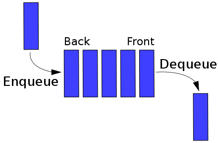

# 큐

## queue

단순한 규칙을 가진 선형 자료구조    
나중에 집어 넣은 데이터가 먼저 나오는 스택과는 반대되는 개념  
선형 큐(Linear Queue), 원형 큐(Circular Queue)가 존재 

<br><br>

## 선입 선출

### FIFO(First In First Out)

<br>



* 큐의 맨 앞 : front 
* 큐의 맨 뒤 : rear, back
* 큐에 요소 추가 : EnQueue
* 큐에 요소 삭제 : Dequeue

<br>

### 예시
* 계산대에 먼저 선 손님이 먼저 계산
* 음식점 웨이팅

<br><br>

## 선형 큐(Linear Queue)

### 배열로 구현하기

스택과 달리, 배열에서 사용하기 조금 어려움  
배열이라 빈 공간은 메꿔지지 않음  
JS 배열은 크기가 유연하게 증감하지만, front나 rear 인덱스 값이 무한정 커질 수 있다는 문제가 있음  
이를 위해 앞당기는 작업을 하게되면 O(n) 선형 시간이 소요  

💡구현이 간단해서 코딩테스트에서 큐를 구현할 때 추천  
⚠️ shift 사용하지 말 것 - 선형 시간이 소요되어 큐에서 기대하는 로직 수행이 어려움  

```js
class Queue {
    constructor() {
        this.queue = [];
        this.front = 0;
        this.rear = 0;
    }
    
    enqueue(value) {
        this.queue[this.rear++] = value;
    }
    
    dequeue() {
        const value = this.queue[this.front];
        delete this.queue[this.front];
        this.front += 1;
        return value;
    }
    
    // front index 값 반환
    peek() {  
        return this.queue[this.front];
    }

    // 큐의 크기 
    size() {
        return this.rear - this.front;
    }
}

const queue = new Queue();
queue.enqueue(1);
queue.enqueue(2);
queue.enqueue(4);
console.log(queue.dequeue()); // 1
queue.enqueue(8);
console.log(queue.size()); // 3
console.log(queue.peek()); // 2
console.log(queue.dequeue()); // 2
console.log(queue.dequeue()); // 4
```

<br>

### 연결 리스트로 구현하기

배열로 구현할 때의 문제를 해결하기 위한 방법  
배열과 달리 인덱스 고민이 필요 없음  
연결 리스트의 `head가 front`, `tail이 rear`  
배열보다는 구현이 조금 어려움  

```js
class Node {
    constructor(value) {
        this.value = value;
        this.next = null;
    }
}

class Queue {
    constructor() {
        this.head = null;
        this.tail = null;
        this.size = 0;
    }

    enqueue(newValue) {
        const newNode = new Node(newValue);
        if (this.head === null) {
            this.head = this.tail = newNode;
        } else {
            this.tail.next = newNode;
            this.tail = newNode;
        }
        this.size += 1;
    }

    // 스택을 연결리스트로 구현했을 때, pop하는 로직과 동일 
    dequeue() {
        const value = this.head.value;
        this.head = this.head.next;
        this.size -= 1;
        return value;
    }

    // head 값 반환
    peek() {
        return this.head.value;
    }
}

const queue =new Queue();
queue.enqueue(1);
queue.enqueue(2);
queue.enqueue(4);
console.log(queue.dequeue()); // 1
queue.enqueue(8);
console.log(queue.size); // 3
console.log(queue.peek()); // 2
console.log(queue.dequeue()); // 2
console.log(queue.dequeue()); // 4
```

<br><br>

## 원형 큐(Circular Queue)

원형 연결리스트와 같이 처음과 끝이 이어져 있는 큐  
한정된 공간을 효율적으로 이용할 때 사용하는 자료구조  
💡 코딩테스트에서 원형 큐를 사용해야하는 상황은 많지 않음  

### 배열로 구현하기

max 사이즈를 받아 큐의 크기를 제한   

```js
class Queue {
    constructor(maxSize) {
        this.maxSize = maxSize;
        this.queue = [];
        this.front = 0;
        this.rear = 0;
        this.size = 0;
    }
    
    enqueue(value) {
        if (this.isFull()) {
            console.log('Queue is full');
            return;
        }
        this.queue[this.rear] = value;
        this.rear = (this.rear + 1) % this.maxSize;
        this.size += 1;
    }
    
    dequeue() {
        const value = this.queue[this.front];
        delete this.queue[this.front];
        this.front = (this.front + 1) % this.maxSize ;
        this.size -= 1;
        return value;
    }
    
    // 큐가 다 찼는지 확인 - 무한정 enqueue를 막을 수 있음    
    isFull() {
        return this.size === this.maxSize;
    }
    
    // front index 값 반환
    peek() {  
        return this.queue[this.front];
    }
}

const queue = new Queue(4);
queue.enqueue(1);
queue.enqueue(2);
queue.enqueue(4);
queue.enqueue(8);
queue.enqueue(16); // Queue is full
console.log(queue.dequeue()); // 1
console.log(queue.dequeue()); // 2
console.log(queue.size); // 2
console.log(queue.peek()); // 4
queue.enqueue(16);
queue.enqueue(32);
console.log(queue.isFull()); // true
```
