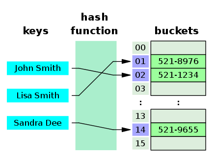

# 해시 테이블

## hash table

해시와 테이블이 합쳐진 자료구조  
프로그래밍 언어에 따라 해시(Hash), 맵(Map), 해시맵(HashMap), 딕셔너리(Dictionary) 등으로 불림  

키-값을 받아 키를 해싱(Hashing, 잘게 다지기)해서 나온 index에 값을 저장하는 선형 자료구조      
한정된 배열 공간에 key를 index로 변환해 값을 넣음 -> key를 잘게 잘라 숫자로 만듦    
추가는 O(1), 키를 알고 있다면 삭제, 탐색도 O(1)

<br>



* bucket : 각 테이블에 해당하는 인덱스
* 테이블의 각 요소는 키-값 모두 저장 

<br><br>

## 표 (table)

어떤 내용을 일정한 형식, 순서에 따라 나타낸 것  

표를 코드로 표현하는 가장 쉬운 방법 -> `배열`에 저장  
인덱스로 배열에 접근하려면, 인덱스 순서대로 데이터가 존재하지 않는 이상 중간에 빈 공간이 생김 -> 낭비

메모리를 절약하는 방법 -> `해시 함수`

<br><br>

## 해시 함수

해시 함수의 선정이 매우 중요  
해시 함수로 테이블의 인덱스를 새로 만듦  
✅ 좋은 해시 함수 : 데이터를 골고루 분배시키는 함수

<br>

### 문제점

value에 데이터가 이미 있는데, 새로 입력하는 데이터와 충돌하는 경우  

> 해당 인덱스를 연결리스트로 구성해 데이터를 연결하면 기존 데이터와 새로운 데이터를 같은 인덱스에 저장 가능

<br>

### 해결 방법

1. 선형 탐사법 : 충돌 발생 시 옆으로 한 칸 이동 
2. 제곱 탐사법 : 충돌 발생 시 충돌이 발생한 횟수의 제곱만큼 옆으로 이동
3. 이중 해싱 : 충돌 발생 시 다른 해시 함수 이용 
4. 분리 연결법 : 버킷의 값을 연결 리스트로 사용해, 충돌 발생 시 리스트에 값을 추가  

<br><br>

## 장단점

### 장점

* key를 알면 value를 O(1)의 성능으로 읽을 수 있음
* 빠른 데이터 읽기, 삽입, 삭제

<br>

### 단점

* 공간 효율성이 나쁨
* 메모리를 많이 차지
* 좋은 해시 함수 구현이 필수

<br><br>

## 코드

### 배열로 구현하기

배열은 객체타입이라 해시 테이블로 사용할 수 있지만, 올바른 사용법은 아님 

```js
const table = [];
table["key"] = 100;
table["key2"] = "Hello";
console.log(table["key"]); // 100
table["key"] = 349;
console.log(table["key"]); // 349
delete table["key"];
console.log(table["key"]); // undefined
```

<br>

### 객체로 구현하기

제일 간단한 방법 

```js
const table = [];
table["key"] = 100;
table["key2"] = "Hello";
console.log(table["key"]); // 100
table["key"] = 349;
console.log(table["key"]); // 349
delete table["key"];
console.log(table["key"]); // undefined
```

<br>

### Map으로 구현하기

set으로 값 추가  
get으로 값 찾기
키값으로 객체나 배열 등 복잡한 값 사용 가능  
객체의 경우, 들어오는 값이 정수가 아닐 경우 전부 문자열로 바꿔버려서 다양한 타입을 넣을 때 유리  
다양한 메소드, 순회가 편함

```js
const table = new Map();
table.set("key", 100);
table.set("key2", "Hello");
console.log(table["key"]); // undefined 
console.log(table.get("key")); // 100
const object = { a: 1 };
table.set(object, "A1"); // Map은 Object도 key로 사용 가능 
console.log(table.get(object)); // A1
table.delete(object);
console.log(table.get(object)); // undefined
console.log(table.keys()); // { 'key', 'key2' }
console.log(table.values()); // { 100, 'Hello }
table.clear();
console.log(table.values()); // { }
```

<br>

### Set으로 구현하기

키-값이 동일하게 저장  
일종의 집합 연산   
중복된 내용을 전부 제거할 때 사용  

```js
const table = new Set();
table.add("key"); // Key와 Value가 동일하게 들어감
table.add("key2");
console.log(table.has("key")); // true
console.log(table.has("key3")); // false 
table.delete("key2");
console.log(table.has("key2")); // false 
table.add("key3");
console.log(table.size); // 2
table.clear();
console.log(table.size); // 0
```
